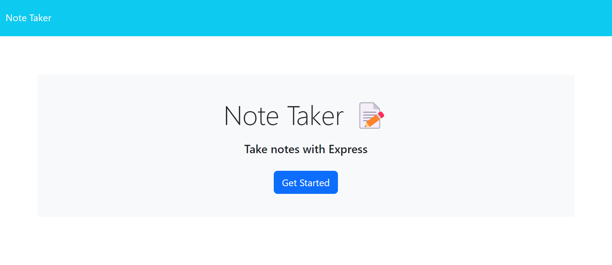
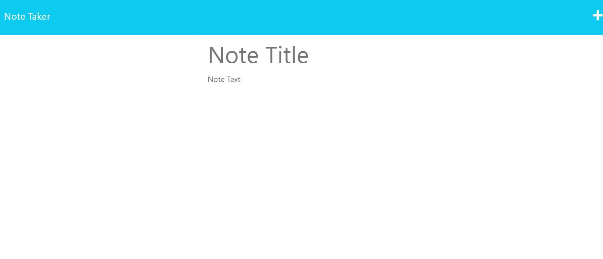
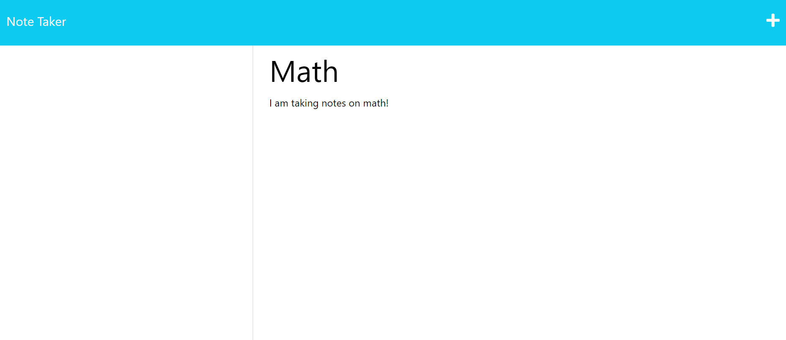

# Note Taker Module 11


## note-taker-module

<br></br>

## Description

As a new developer, I want to create an app and deploy on Heroku that will allow me to take notes and save them. This will allow for better organization and time management so that I can keep track of things I do not want to forget.
## The Task

Creating an application called Note Taker that can be used to write and save notes. This application will use an Express.js back end and will save and retrieve note data from a JSON file.


##  Features :

1) Smooth, clean interface
2) An easy-to-get-started button to begin note taking
3) A bold title for the note
4) A section to begin writing and an option to start a new note


<br></br>

## User Story

```md
AS A small business owner
I WANT to be able to write and save notes
SO THAT I can organize my thoughts and keep track of tasks I need to complete
```

## Acceptance Criteria

```md
GIVEN a note-taking application
WHEN I open the Note Taker
THEN I am presented with a landing page with a link to a notes page
WHEN I click on the link to the notes page
THEN I am presented with a page with existing notes listed in the left-hand column, plus empty fields to enter a new note title and the note’s text in the right-hand column
WHEN I enter a new note title and the note’s text
THEN a Save icon appears in the navigation at the top of the page
WHEN I click on the Save icon
THEN the new note I have entered is saved and appears in the left-hand column with the other existing notes
WHEN I click on an existing note in the list in the left-hand column
THEN that note appears in the right-hand column
WHEN I click on the Write icon in the navigation at the top of the page
THEN I am presented with empty fields to enter a new note title and the note’s text in the right-hand column
```

<br></br>

# UI SneakPeak ❤️ 





<br><br>

# Refrences

- <a href="https://coding-boot-camp.github.io/full-stack/heroku/heroku-deployment-guide">edX Boot Camps LLC

- <a href="https://www.youtube.com/@WebDevSimplified">Web Dev Simplified YouTube Channel

- <a href="https://www.w3schools.com">w3schools</a>

- Ask BCS

- <a href = "https://calendly.com/d/dnc-wpf-c7s">UCF Tutors</a>

**For more, reach me at laryn.n99@gmail.com**

<br>
